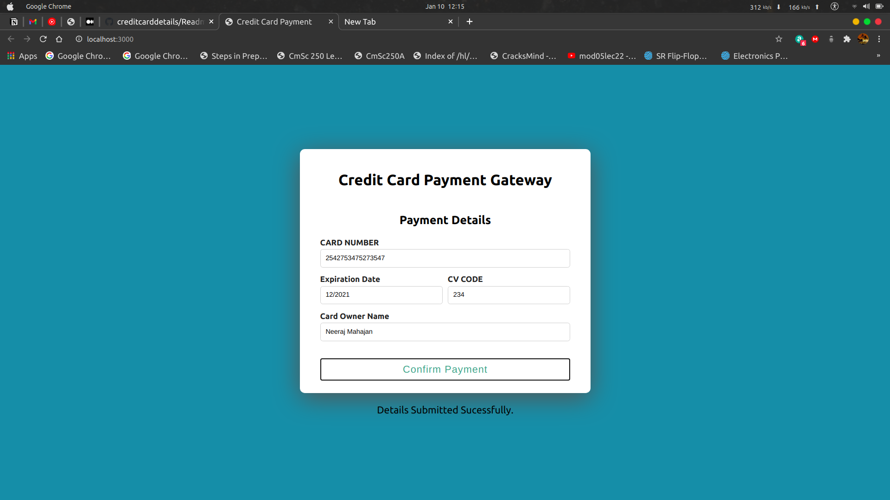
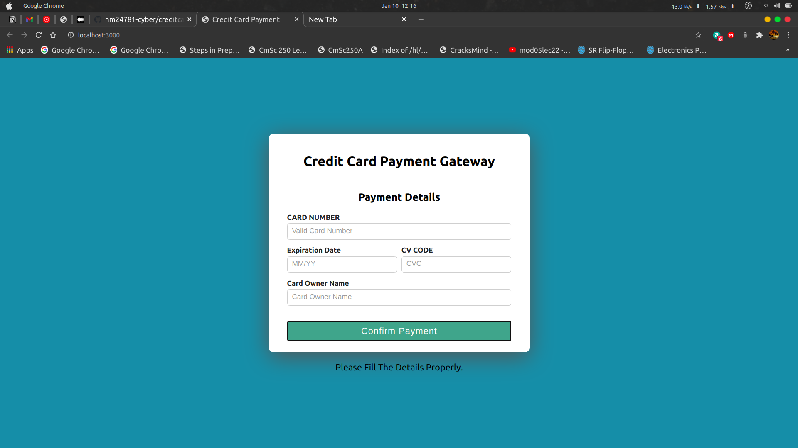

# Steps
To Run Backend Nodejs App

cd api/

yarn install

yarn start

To Run React Frontend App

cd client/

yarn install

yarn start

### Frontend will be on localhost:3000

## UI 

## Successful Submit

## Invalid Details

