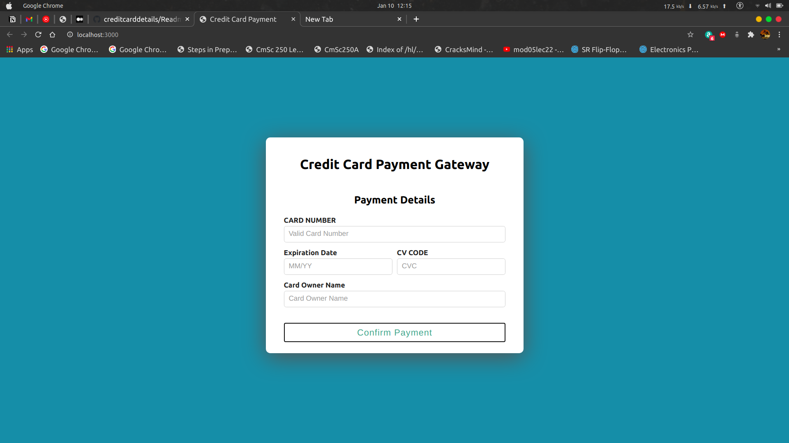

# Steps
To Run Backend Nodejs App

cd api/

yarn install

yarn start

To Run React Frontend App

cd client/

yarn install

yarn start

## UI 

## Successful Submit

## Invalid Details

Frontend will be on localhost:3000

